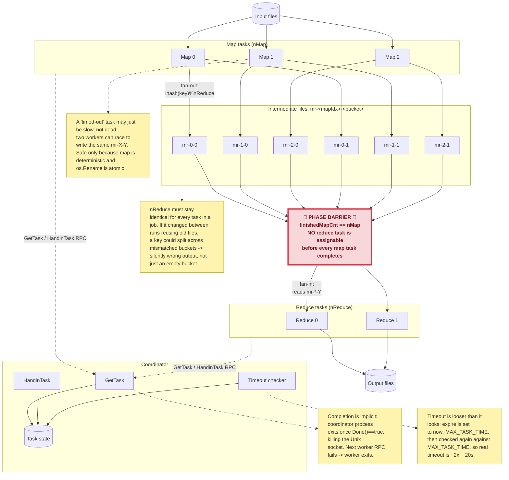

# MapReduce (Lab1) — Architecture & Review Notes

The barrier node is the key structural fact: it's not a scheduling nicety,
it's forced by the fan-out/fan-in shape — every map task writes into every
bucket, so every reduce task's fan-in spans *all* map tasks by construction.
"All maps done" and "any reduce task ready" are the same condition.

**Open question (parked, not yet answered):** what happens if a worker
crashes *between* writing `mr-X-Y` to disk and calling `HandinTask`? (Hint:
can the coordinator tell "slow" apart from "dead but already wrote the
file" — and given N3 above, does it need to?)
