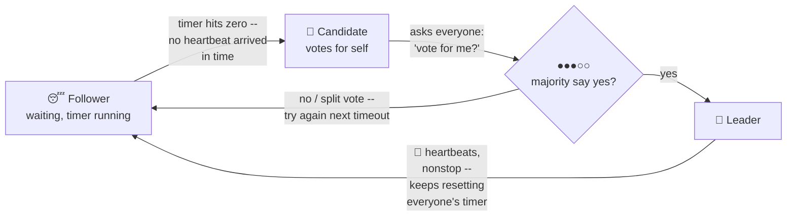
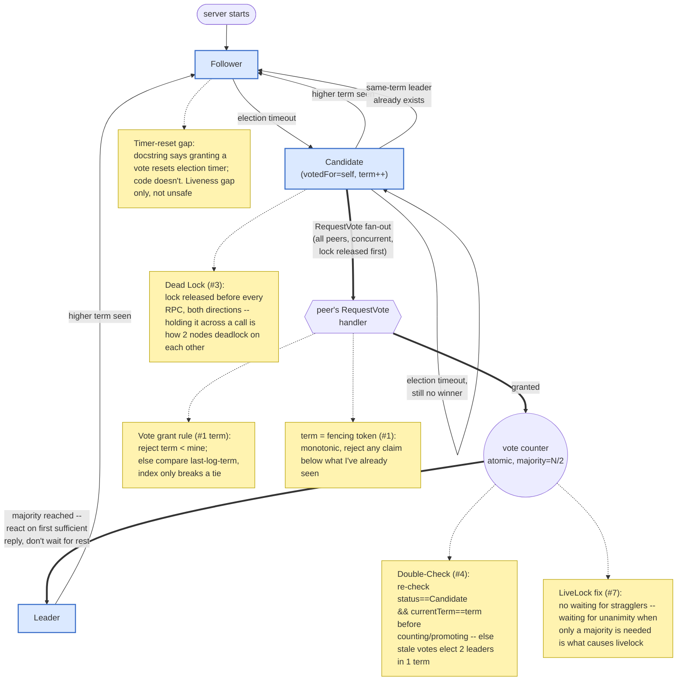

solved problems: split-brain, strong-consistency. dismiss network package delayed, lost, out of order

Raft guarantees about leader election:
Election Safety: at most one leader can be elected in a given term.
Only the nodes with all committed logs can be new leader
Newly elected leader no need to import missing committed logs from someone else after winning

## The principle, at a glance

It's a race against a random timer, decided by majority, kept quiet by heartbeats:

Read it as a loop: everyone waits quietly with their own random countdown: whoever
hits zero first (because they haven't heard a heartbeat) speaks up and asks for
votes; if more than half agree, that node becomes leader and starts sending
heartbeats, which is the only thing preventing everyone else's countdown from
ever reaching zero again. Kill the leader, heartbeats stop, silence resumes,
and the race restarts. The randomness in the countdown is what (usually) keeps
two nodes from hitting zero at the same instant and splitting the vote.

## Implementation mechanics (state machine + correctness details)

1. Why is there a term mechanism for leader election. can cluster elect leader without term? - no
Intuitively understand the "term": Fencing Token!
Monotonically non-decreasing. 
Reject Stale Data with lower value.

2. why is there a Candidate state for Raft peers, what about just Follower and Leader?
For leader election, are 2 states enough? No, if so, Follower state should track more state field

3. Dead Lock: RPC other peers without release the local mutex lock, two Raft peers may wait each forever!

4. Double Check: after get RPC replies, must checkout whether states of Raft node are changed by other process,
because these shared states are not protected by lock during the RPC.
Bad Outcome Scnario: Candidate fans out RequestVote to peers. During RPC it will drop and re-acquire lock, 
if you don't double check current term after get RPC replies, the candidate could count votes from old-term peers as votes from current-term peers.
the candidate could change itself into leader. Causing two leaders in the same term.

5. The leader's heartbeats are particularly similar to the pheromones of queue ant, 
both for suppressing followers.

6. What does a node need to do when it claims to have been selected as the leader?
run a timer task to emit heartbeats to all other peers periodically
reflush the metadata about other nodes in his leader perspective, this states must be maintained by leader
handle requests from external Clients on behalf of the Raft cluster.
log replicas 

7. LiveLock in Leader Election: node A/B/.. transition between state Candidate and Follower, no one blocked, no leader elected.
Reason 1: duration of election compagin is longer than others' election timeout, For example, candidate node gets a majority, but waits stragglers to reply forever.
Reason 2: each node's election timeout is the same or short, always trigger election at the same time.